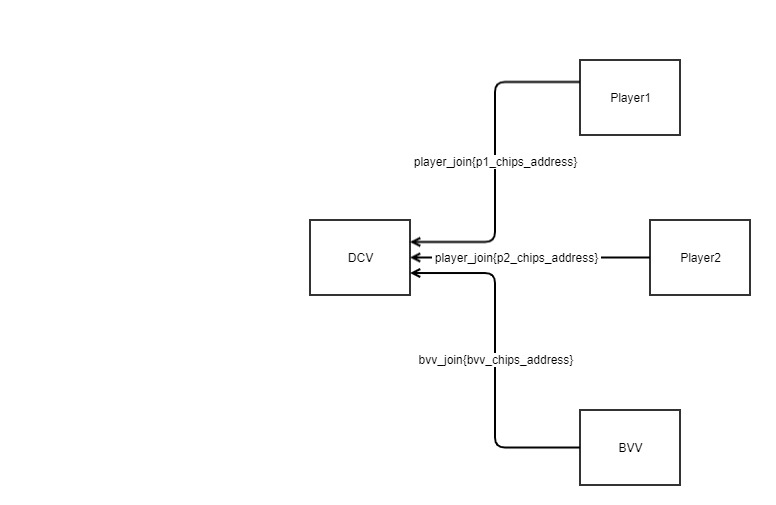
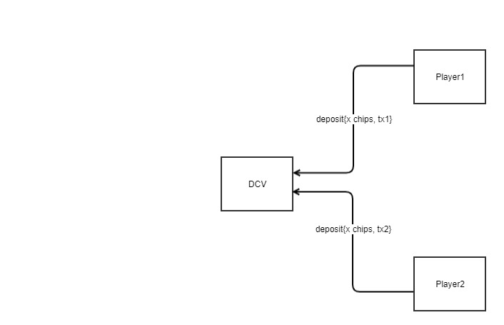
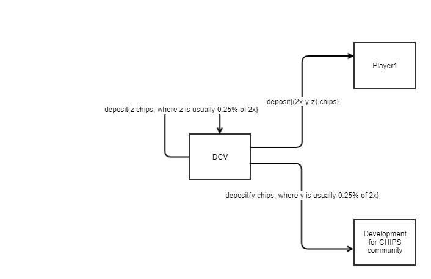

* The steps to deposit and withdrawl of CHIPS which are locked by multisig transaction during the game are mentioned below.

* While joining players and BVV shares their CHIPS address to the DCV
  

* Once the table is filled, DCV broadcasts all the entities CHIPS address to all to compute multisig address
 `
  * player1_chips_address
  * player2_chips_address
  * bvv_chips_address
  * dcv_chips_address
  `
 
 * Now 2 of 4 multisig address is computed
 * Now player1 and player2 deposit the `x` amount of CHIPS to this address by making the transactions `tx1` and `tx2` respectively and shares the tx info to the DCV, where `x` is the table stack.
 
 
 
 * DCV validates the transactions, and sets the limit on the amount of CHIPS that players should spend to `x`.
 * Game will be played with realtime betting using LN transactions. Here the amount used in LN channels is the normalized value of `x`, i.e in our case the normalization factor is `1000:1` means if a table stack is of `1000 CHIPS` then `1 CHIP` worth of LN transactions happens during the game.
 * Once the winner is identified the the amount from the multisig address is paid back to the winner, excluding a portion of it to the developement and for the dealer.
 
 
